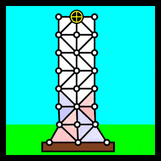

# softquake

Simulates the movement of softbody buildings under the effect of earthquakes.



## Running

**Requires several libraries listed in the `requirements.txt` file**

```
cd softquake
```

```
python main.py
```

The program works by writing information and reading from the user line by line (from lists of presets) to aid the user in the input of the simulation parameters *(in other terms, reads from standard input)*.

## About

Softbody structure is assumed to:
* Have Hookean springs and dampeners connecting the set of nodes.
* Have no self collision property.
* Have no effect on the earthquake plate.
* Be under the influence of gravity.

Earthquake plate is assumed to:
* Be constrained to horizontal motion.
* Move based on a singular sine with specific frequency and amplitude.
* Have no frictional interaction with the softbody.

Simulation is implemented to:
* Use a verlet integrator scheme.
* Use accurate distance and time units.
* Measure and visualize the contraction and expansion of the individual triangles in the mesh.
* Account for the effect of external forces.
* Use Delanuay triangulation for mesh.

Visualization is made to:
* Make a real-time video diagram using the amazing PyCairo and FFmpeg libraries.
* Show motion of a node of interest *(sensor)* in time.
* Do spectral analysis of the horizontal acceleration of sensor.
